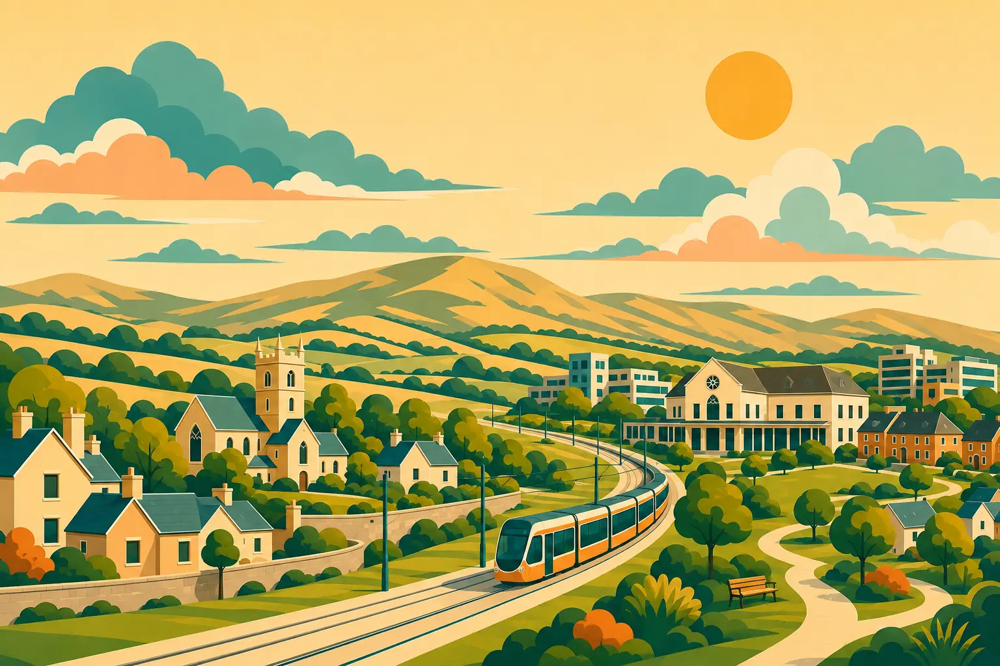

# Saggart & Citywest Together

A community information website that supports connection, inclusion and local knowledge across Saggart and Citywest, County Dublin.

**HTML · CSS · JavaScript**

[Visit the website](https://samobrienolinger.github.io/saggart-and-citywest-together/) · [Distinctive proposition](#distinctive-proposition-and-educational-contribution) · [Getting started](#getting-started) · [Repository guide](#repository-guide) · [Checks](#checks-and-review) · [Credits](#credits-and-reuse)



## Distinctive proposition and educational contribution

> **A community-led guide that connects local knowledge, practical support and opportunities to participate in Saggart and Citywest. Know the place, find the support and take part.**

The strongest proposition is not another general directory. It is a **place-specific combination of civic learning, newcomer support navigation and shared community identity**, intended for both newcomers and established residents. Local history, everyday services and community activity belong in the same experience: understanding an area and finding a place within it are connected educational goals.

### A potentially useful educational combination

| What the site brings together | Potential educational contribution |
| --- | --- |
| Local history and civic information, imagery and an interactive quiz | Give newcomers and established residents a shared starting point for learning about their area and discussing belonging. |
| Citywest support signposting and links to public and community sources | Help people understand where to turn for information and support without replacing the organisations responsible for eligibility, advice or delivery. |
| Community activity and participation information alongside practical guidance | Connect finding information with taking part in neighbourhood life, rather than treating residents only as service users. |

**Its distinctiveness lies in the combination and the locality.** Saggart and Citywest are not interchangeable with a national migration-information portal. The site's local curation and community perspective provide a basis for connecting information that residents would otherwise need to assemble across separate sources. The potential contribution is both practical and educational: easier orientation, a better understanding of local support networks and a common resource for welcome, conversation and participation.

### Similar product: Integreat

[**Integreat — Germany's digital integration platform**](https://integreat-app.de/en/) provides locally maintained, multilingual information for newcomers through a website, an offline-capable app and printable information. It is a strong comparator for local integration and service navigation.

Saggart & Citywest Together's distinguishing proposition is its **specific neighbourhood context and the combination of support navigation with local history, civic learning and visible community life**. This is an argument for a useful local contribution, not a claim that multilingual directories or community websites are new. Integreat also offers a useful lesson: clear responsibility for reviewing local information is as important as the interface.

### Contribution within the wider learning portfolio

Alongside [A New Life in Ireland](https://samobrienolinger.github.io/My-New-Life-in-Ireland/), which explores migration and settlement, and [Stopped: Both Sides](https://samobrienolinger.github.io/stopped-both-sides/), which explores public/Garda encounters, this site supplies the **hyperlocal community-learning layer**. Together they offer a potentially useful combination of migration understanding, local belonging and rights literacy. They remain separate resources, not an integrated public service.

Local content review and user testing are needed to establish whether visitors find appropriate information and participation opportunities more easily. These are intended contributions, not measured outcomes. The comparator description was checked against its official website on **14 September 2026**; no affiliation, endorsement or exhaustive claim of uniqueness is implied.

## What you can explore

- Local learning resources and an interactive quiz.
- A Citywest support directory and practical signposting.
- A gallery of local history and community imagery.
- About, accessibility, contact and privacy pages.

## Using the project

1. Start with the local learning pages or the Citywest support directory.
2. Follow source links for information from the relevant organisation.
3. Explore the gallery and community work, or take the local-knowledge quiz.

> **Project notes:** Information is independently compiled from linked public sources. Check the relevant service provider for current eligibility and availability. The contact page provides a direct email link and a copyable address. Visitors send messages from their own email service.

## Getting started

Requires Git, a browser and a local HTTP server. Python 3 provides one without installing application packages.

```bash
git clone https://github.com/SamOBrienOlinger/saggart-and-citywest-together.git
cd saggart-and-citywest-together
python3 -m http.server 8000 --bind 127.0.0.1
```

Open [localhost:8000](http://localhost:8000). Serve the repository over HTTP so module imports, relative assets and page links resolve correctly.

For a development preview with automatic updates, use Node.js 20.19+ (20.x), or 22.12+ and npm:

```bash
npm ci
npm run dev -- --port 4173
```

Open [localhost:4173](http://localhost:4173). Vite is a development dependency only; publishing still serves the original static HTML, CSS, JavaScript and images without a build step.

Alternatively, `npm run serve` starts a simple server on port 4173. This command uses `npx` to obtain `http-server`, so its first run needs an internet connection. The Python option above does not need Node.js or npm.

## Repository guide

| Path | Purpose |
| --- | --- |
| [index.html](index.html) | Primary browser entry point |
| [assets/](assets/) | Project styles, scripts, data and imagery |
| [tests/](tests/) | Automated test source |
| [.github/workflows/](.github/workflows/) | Build, test or deployment workflows |
| [package.json](package.json) | Package dependencies and available commands |

## Checks and review

Use a supported Node.js version and npm for the command below. The tests use Node's built-in test runner and need no dependency installation.

| Command | Purpose |
| --- | --- |
| `npm test` | Run the existing test suite |

For a manual review, follow the main user journey, check keyboard navigation and narrow-screen layouts, and inspect the browser console for missing assets or failed requests.

Supporting notes: [TESTING.md](TESTING.md) · [design-qa.md](design-qa.md).

Generate fresh results from the revision you are working on; historical test reports describe earlier runs.

The shared responsive stylesheet loads directly on all ten pages. Compact navigation remains available when JavaScript is disabled; when enabled, the menu and translation panel support keyboard dismissal and available-height scrolling. The support directory reflows into labelled entries on smaller screens. Browser coverage and remaining device checks are recorded in [TESTING.md](TESTING.md).

## Deployment

A GitHub Pages site is configured for this repository. Its published URL is linked at the top of this README.

Review [.github/workflows/pages.yml](.github/workflows/pages.yml) before changing the publishing workflow or source directory.

## Credits and reuse

Website development by Sam O'Brien-Olinger / Sam Tim Solutions for Saggart & Citywest Together.

Local and civic content draws on South Dublin County Council, the Placenames Database of Ireland, CSO Census 2022 and other named public sources. The [About page source register](about.html#sources) records the exact references.

Media acknowledgements already recorded on the site include:

- **The Echo** — the community-potluck article screenshot and coverage linked from [Community in action](about.html#our-work).
- **Citywest Business Campus** — the campus history imagery, linked to its source in the [Gallery](gallery.html).
- **P L Chadwick / Geograph Ireland** — the Luas-at-Saggart photograph, credited on the Gallery page under CC BY-SA 2.0.

Other gallery items retain their individual source links. These acknowledgements do not grant additional rights to the photographs, article screenshot, illustrations or third-party content.

Design decisions, original feature notes, historical testing evidence and detailed acknowledgements remain available in the preserved project record:

- [README.md · original project record](https://github.com/SamOBrienOlinger/saggart-and-citywest-together/blob/75a78455c6315b4a32c274f5c1f48c5341d8c6d9/README.md)

No repository-level licence file is present in this snapshot. This README does not grant additional reuse permissions. Check with the relevant rights holders before reusing code, written content or assets.

## Support

Repository maintained in [Sam O’Brien-Olinger’s GitHub account](https://github.com/SamOBrienOlinger). For a problem or suggested improvement, [open an issue](https://github.com/SamOBrienOlinger/saggart-and-citywest-together/issues) with the affected page or command, steps to reproduce, and expected behaviour.

[Back to top](#saggart--citywest-together)

### Photo gallery

The six photographs are part of [History and heritage](learn.html#heritage), with
their captions, source credits and related local stories. Previous and Next buttons,
swipes and labelled thumbnails select a photograph; a full-image dialog preserves
keyboard focus when closed. Arrow keys follow the reading direction, and Home and
End jump to the first and last photographs. All photographs remain readable without
JavaScript. Old `gallery.html` links, including individual photograph links, lead to
the combined section and retain translation settings.

Edit photograph details in `assets/data/history-photos.js` and local stories in
`assets/data/content.js`, then run `node scripts/build-learning-page.mjs`. The
generated HTML is committed so the whole section is available to page translators.
Gallery styles and behaviour are in `assets/css/gallery.css` and `assets/js/gallery.js`.
